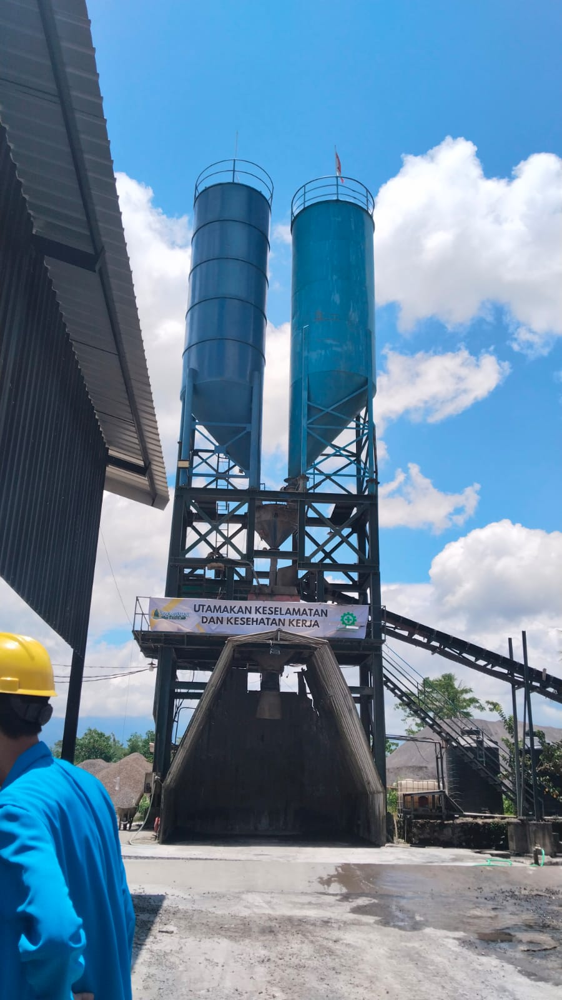

# PT. Prambanan Beton – Website

Website company profile PT. Prambanan Beton berbasis PHP murni (tanpa framework).

---

## 📁 Struktur Folder

```
prambanan-beton/
├── index.php          → Halaman Beranda
├── tentang.php        → Halaman Tentang Kami
├── produk.php         → Halaman Produk
├── portofolio.php     → Halaman Portofolio & Ulasan
├── kontak.php         → Halaman Kontak
│
├── includes/
│   ├── navbar.php     → Komponen navbar (dipakai semua halaman)
│   └── footer.php     → Komponen footer (dipakai semua halaman)
│
├── assets/
│   ├── css/
│   │   └── style.css  → Semua styling website
│   ├── js/
│   │   └── main.js    → Animasi, interaksi, counter
│   └── images/        → Letakkan semua gambar di sini
│
└── README.md
```

---

## 🖼️ Cara Menambahkan Logo & Gambar

### 1. Logo Perusahaan
Letakkan file logo di: `assets/images/logo.png`

Kemudian di `includes/navbar.php`, hapus atau comment baris `<div class="logo-icon">...</div>` 
dan aktifkan baris ini:

```html

```

### 2. Foto Pabrik / Kantor (di index.php & tentang.php)
Letakkan file di: `assets/images/pabrik.jpg`

Di `index.php` dan `tentang.php`, ganti placeholder emoji dengan:
```html

```

### 3. Foto Proyek (di portofolio.php)
Letakkan file di:
- `assets/images/proyek-1.jpg` → Hotel Jember
- `assets/images/proyek-2.jpg` → Koperasi Merah Putih
- dst.

Di `portofolio.php`, ganti `<div class="porto-img-placeholder">` dengan:
```html

```

---

## ⚙️ Cara Menjalankan

### Opsi A – XAMPP / Laragon (Lokal)
1. Copy folder `prambanan-beton` ke `htdocs/` (XAMPP) atau `www/` (Laragon)
2. Buka browser: `http://localhost/prambanan-beton`

### Opsi B – PHP Built-in Server
```bash
cd prambanan-beton
php -S localhost:8000
```
Buka browser: `http://localhost:8000`

### Opsi C – Upload ke Hosting
Upload semua file ke folder `public_html/` atau `www/` di hosting cPanel.

---

## 🎨 Warna & Font

| Elemen | Nilai |
|--------|-------|
| Hijau Tua (primary) | `#1B5E20` |
| Hijau Gelap | `#0d2b0f` |
| Gold/Emas | `#F9A825` |
| Font Heading | Playfair Display |
| Font Body | Plus Jakarta Sans |

---

## 📱 Fitur

- ✅ Responsive (Mobile, Tablet, Desktop)
- ✅ Navbar sticky dengan efek scroll
- ✅ Mobile hamburger menu
- ✅ Animasi scroll (fade-in saat elemen muncul)
- ✅ Counter animasi (angka statistik)
- ✅ Ripple effect pada tombol
- ✅ Floating WhatsApp button
- ✅ Filter proyek di halaman portofolio
- ✅ Form kontak interaktif
- ✅ Footer lengkap dengan sosial media

---

## 📞 Kontak Default

Edit informasi berikut di `includes/footer.php` dan `kontak.php`:
- **Telepon:** 0852-5998-2223
- **Email:** PrambananID@gmail.com  
- **Alamat:** Jl. Raya Lumajang–Jember, Gambirono, Bangsalsari, Jember 68154
